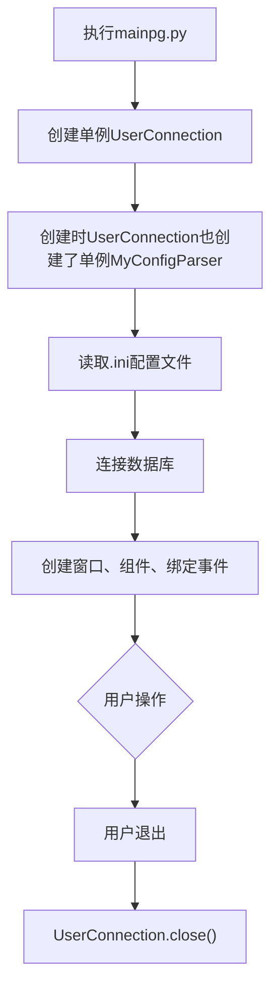

# MiniTTK + Automation App

**搭建minittk框架并且实现一个登入会议+数据管理的小工具**

有任何体验问题或者疑问请发至: <a>shanebilibili@outlook.com</a>

---

## 为什么? 有什么功能?

### 为什么:

本人为初中生，考虑到上网课时进入会议那些繁琐的操作，自己一心想从重复性劳动中解脱，因而写了个Minittk优化质量节省时间，再用该框架开发出了一个小工具，希望能帮助很多人:
smile:

### 整体架构:

更多见下文

- **Minittk**

    - 类`Window`
        - 用于创建TopLevel/Window窗口, 内部封装了一些常用函数


- 私有类`MyWidgets`
    - 里面封装了`Widgets`(比如Entry, Combobox等)的相关函数，使得编写质量优化


- `constants.py`
    - 里面包括很多常量，用于创建组件、执行mysql语句等


- 类`WidgetQueue`
    - 组件队列, 可以用于批量打包组件/获取组件值等等


- 抽象类 `support.BaseConnection(pymysql.Connection)`
    - 里面包含相关函数定义的规范, 用于连接到MySQL数据库


- 单例 `support.UserConnection(BaseConnection)`

    - 派生于`BaseConnection`，里面包含了使用入会小工具的所有数据库操作的函数


- 单例 `support.MyConfigParser(configparser.ConfigParser)`

    - 用于读写`.ini`文件, 里面对访问或者导入保存文件等操作进行了部分封装


- 单例 `support.UIAutomation`

    - 用于自动化操作GUI，内部封装了操作腾讯会议/Zoom的函数

- **App**

    - 从mysql中选择数据条目并且自动进入会议软件
    - 简单管理数据，对数据/表格进行CRUD等操作
    - 可配置性高，从数据库到自动化脚本的配置

### 自动化实现:



## 环境配置

Python 3.10.4 (or above(?))

### 安装第三方库:

**ttkbootstrap:**

```
pip install ttkbootstrap
```

**pymysql:**

```
pip install pymysql
```

**configparser:**

```
pip install configparser
```

### 软件配置:

在`.ini`文件中配置需要使用如下模板:

```ini
[MySQL]
host = localhost
port = 3306
user = root
password = 123456
database = minittk

[App]
theme = cosmo
startup.x = 450
startup.y = 200

[Launch]
tencentmeeting = xxx\xxx\wemeetapp.exe
zoom = xxx\xxx\xxx\Zoom.exe
```

| Option         | Definition                                            |
|:---------------|:------------------------------------------------------|
| host           | MySQL连接的域名                                            |
| port           | 连接的端口                                                 |
| user           | 连接的用户名                                                |
| password       | 密码                                                    |
| database       | 选择的数据库                                                |
| theme          | 软件启动时使用的主题, 更多主题请参考[ttkbootstrap官网](https://fuck.com) |
| startup.x/y    | 分别代表着软件启动的x和y坐标                                       |
| tencentmeeting | 腾讯会议的可执行程序启动路径                                        |
| zoom           | zoom的可执行程序启动路径                                        |

